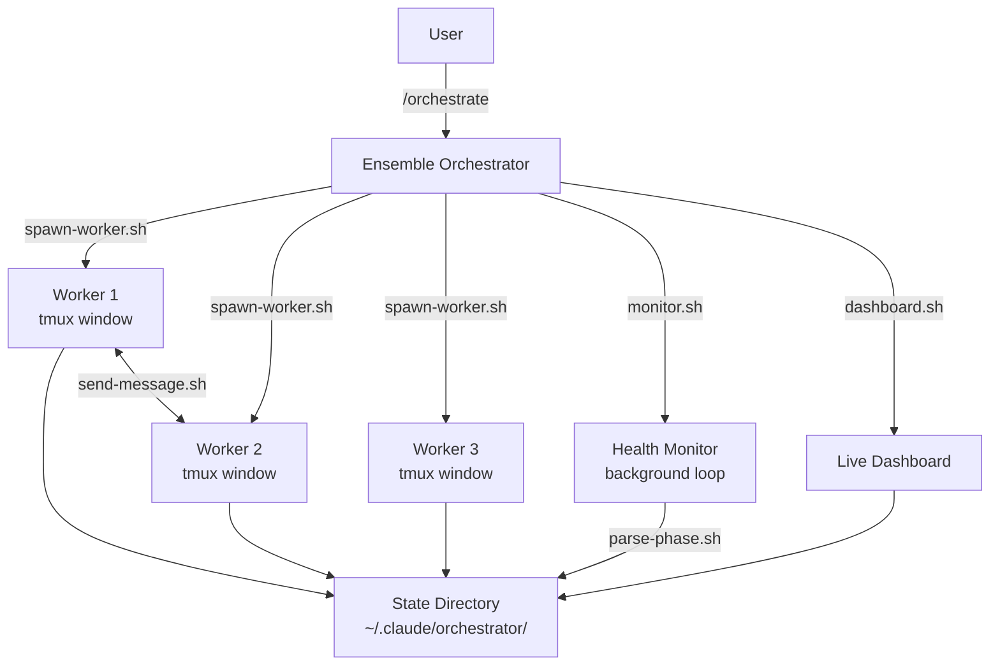

# Architecture

## Overview

Ensemble is a multi-worker orchestration layer for Claude Code that spawns autonomous AI agents as tmux windows, each working on an independent task within a larger project. It coordinates parallel workstreams through file-based state management and messaging, provides real-time health monitoring with auto-recovery, and renders a live terminal dashboard so you can watch all workers progress through their phases simultaneously.

## Components

### spawn-worker.sh

Creates and launches Claude Code workers inside tmux windows. Each invocation generates a unique worker ID and UUID session, writes worker metadata as JSON to the state directory, builds a system prompt from templates, ensures the `ensemble` tmux session exists (creating one with a dashboard status window if needed), and sends the `claude -p` command into a new tmux window. The script validates dependencies (jq, uuidgen, tmux, python3), checks for duplicate active workers, and records the tmux window index back into the worker JSON for later reference.

### monitor.sh

Background health monitoring loop that iterates over all worker JSON files each cycle. For every active worker it calls parse-phase.sh functions to update phase, cost, progress, and status from the log file. It detects stuck workers (no output for 5+ minutes) and marks them accordingly. Crashed workers are automatically resumed up to 2 times via `claude -p --resume`. Can run as a single check or as a continuous loop at a configurable interval.

### dashboard.sh

Live terminal status display that reads all worker JSON files from the state directory and renders a Unicode box-drawing table with color-coded status indicators. Shows worker ID, project name, current phase, a progress bar, percentage, status (active/stuck/crashed/completed), and heartbeat age. Includes a summary panel with total runtime, budget spent, and per-status worker counts. Designed to run under `watch -n 5` for live refresh.

### send-message.sh

Cross-worker file-based messaging system. Creates JSON message files in the messages directory with the naming convention `<from>-to-<to>.json`. Each file contains a `.messages` array where each entry has from, to, text, payload, timestamp, and delivered fields. Supports sending messages, retrieving pending (undelivered) messages for a worker, marking messages as delivered, and delivering messages to a worker via `claude -p --resume` in tmux.

### parse-phase.sh

Stream-JSON log parser that extracts structured information from Claude Code's `--output-format stream-json` logs. Provides functions to detect the current phase (via explicit `[PHASE:xxx]` markers or Superpowers skill keyword fallback), extract cumulative cost from result events, detect completion status (running/success/error), count conversation turns, extract the last assistant text, and estimate progress percentage from the current phase.

## Architecture Diagram



## State Management

Worker state is stored as individual JSON files in `~/.claude/orchestrator/workers/`, one file per worker (e.g., `worker-backend.json`). All updates use atomic writes (write to `.tmp`, then `mv`) to prevent corruption.

### Worker JSON Schema

| Field            | Type    | Description                                                |
|------------------|---------|------------------------------------------------------------|
| `id`             | string  | Unique worker identifier, e.g. `worker-backend`           |
| `session_id`     | string  | UUID for the Claude Code session (used for `--resume`)     |
| `project_dir`    | string  | Absolute path to the project working directory             |
| `task`           | string  | Natural language task description given to the worker      |
| `phase`          | string  | Current detected phase (see Phase Detection below)         |
| `status`         | string  | One of: `active`, `stuck`, `crashed`, `completed`          |
| `budget_usd`     | string  | Maximum budget in USD allocated to this worker             |
| `spent_usd`      | number  | Cumulative cost in USD extracted from log result events    |
| `spawned_at`     | string  | ISO 8601 UTC timestamp of when the worker was created      |
| `last_output_at` | string  | ISO 8601 UTC timestamp of the last log file modification   |
| `tmux_window`    | number  | tmux window index within the `ensemble` session (or null)  |
| `resume_count`   | number  | How many times this worker has been auto-resumed (max 2)   |
| `progress`       | number  | Estimated completion percentage (0-100)                    |
| `notes`          | string  | Free-form one-line description or status note              |

## Phase Detection

Ensemble tracks 7 phases that represent the lifecycle of a worker's task. Phases are detected by parse-phase.sh from the worker's stream-json log.

| Phase          | Progress | Detection Method                                       |
|----------------|----------|--------------------------------------------------------|
| `initializing` | 5%       | Default phase before any log output is detected        |
| `brainstorming`| 15%      | `[PHASE:brainstorming]` marker or `brainstorming` skill keyword |
| `planning`     | 30%      | `[PHASE:planning]` marker or `writing-plans` skill keyword |
| `implementing` | 60%      | `[PHASE:implementing]` marker or `test-driven-development` skill keyword |
| `reviewing`    | 85%      | `[PHASE:reviewing]` marker or `requesting-code-review`/`code-reviewer` skill keyword |
| `completing`   | 95%      | `[PHASE:completing]` marker or `finishing-a-development-branch` skill keyword |
| `done`         | 100%     | `[PHASE:done]` marker or result event with `subtype: success` |

Detection priority: explicit `[PHASE:xxx]` markers in the log are checked first. If none are found, the parser falls back to scanning for Superpowers skill keywords and maps them to the corresponding phase. The most recently occurring keyword in the log determines the current phase.

## Messaging

Cross-worker messaging uses a file-based queue stored in `~/.claude/orchestrator/messages/`.

### Message File Format

Files are named `<from-worker>-to-<to-worker>.json` and contain a `.messages` array:

```json
{
  "messages": [
    {
      "from": "worker-backend",
      "to": "worker-frontend",
      "text": "API schema ready",
      "payload": {"endpoints": ["/api/todos"]},
      "timestamp": "2026-03-03T12:00:00Z",
      "delivered": false
    }
  ]
}
```

### Message Lifecycle

1. **Send**: `send_message()` appends a new entry to the messages array with `delivered: false`.
2. **Retrieve**: `get_pending_messages()` collects all undelivered messages addressed to a worker.
3. **Deliver**: `deliver_messages()` sends pending messages to the worker via `claude -p --resume` in its tmux window, then marks them as delivered.
4. **Mark**: `mark_delivered()` sets `delivered: true` on all messages in the file.

All file writes are atomic (write to `.tmp`, then `mv`) to prevent corruption from concurrent access.
